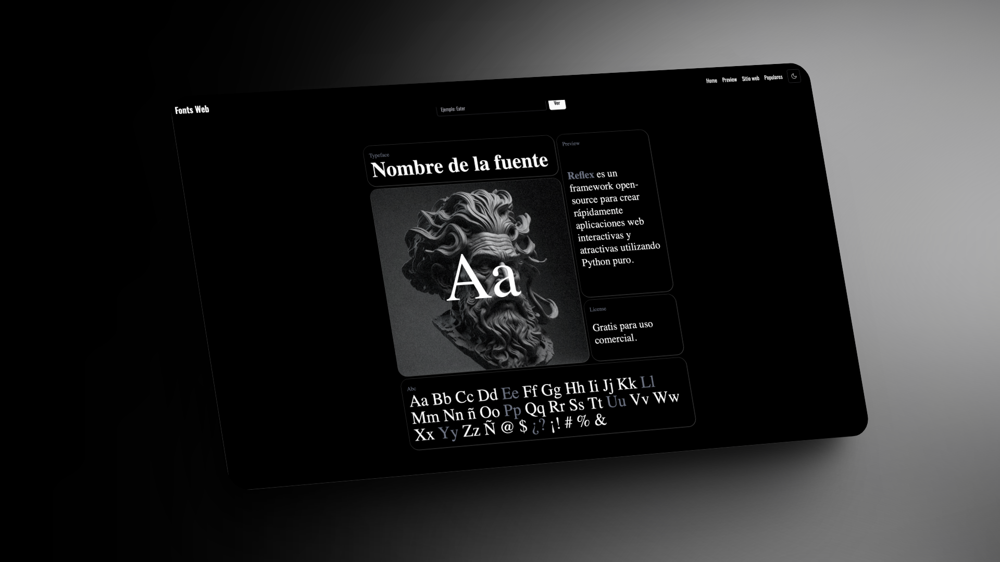
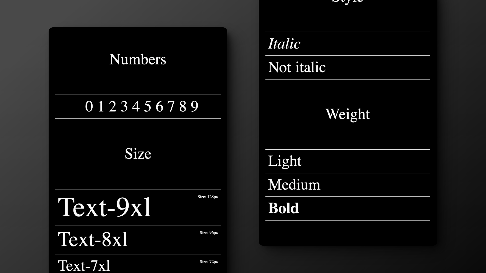
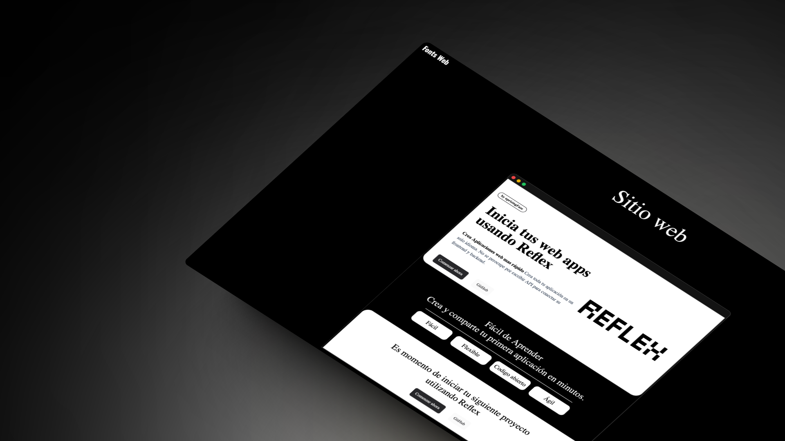
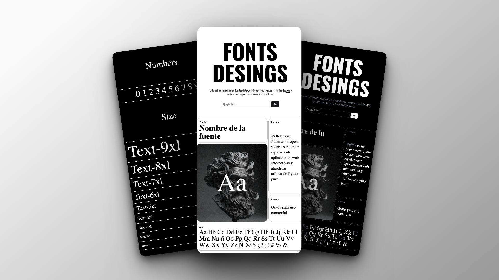

# Fonts Web

Aplicación web para previsualizar fuentes de [Google Fonts](https://fonts.google.com/).

Con [Fonts web](https://fontsweb.online) puedes darte una buena y breve idea de cómo se verían en un entorno real de tu software con diversos **ejemplos** simples que facilitan su rápido uso para así mejorar tu productividad.

#### Diseño moderno y minimalista

Su diseño mantiene en armonía las palabras y letras para de esta forma apreciar correctamente las fuentes.

### Atención al detalle

Observa las variables en sus opciones más populares.

### ¿Todavía no te queda muy claro?

En la web encontrarás una pequeña landing para que te des una idea 100% real.

### Diseño responsive con modo Dark/Light mode. 

La aplicación se adapta perfectamente a cualquier dispositivo, ya sea un teléfono o una tableta. Además, cuenta con modo claro y oscuro.

###### Gracias por tomarte tu tiempo de ver mi proyecto. 

No olvides que la web es 100% gratuita y seguiré trabajando en ella agregando nuevas funcionalidades que realmente aporten a todos los desarrolladores.
